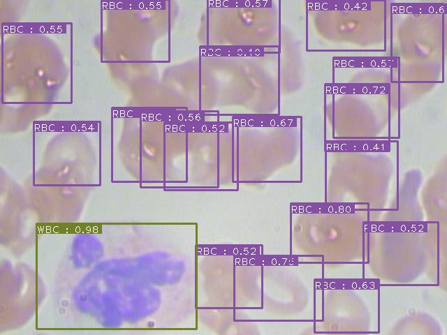
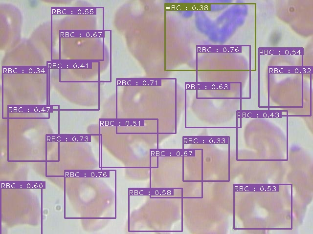
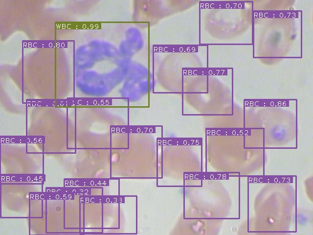

# SSD: Single Shot MultiBox Detector

## Introduction

This is a PyTorch **SSD-Resnet50** implementation based on the GitHub post from Viet Nguyen. The implementation has been modified to support a Custom dataset in CoCo format and to support newer versions of pycocotools.

The dataset used is the Blood Cell dataset from Kaggle (https://www.kaggle.com/datasets/paultimothymooney/blood-cells). The dataset has 3 classes (WBC,RBC and Platelets). The dataset has below structure :

customcoco_dataset  
  |  
  |- Annotations  
  |   | Train.json  
  |   L Test.json  
  |- Images (jpeg files)  

Some test examples are as below  
   
   
  

## Author : Kuljeet Singh